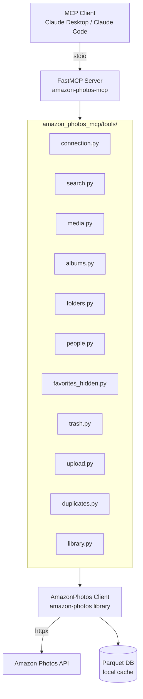

# Amazon Photos MCP

[](https://github.com/jmattwhitt/amazon-photos-mcp/actions/workflows/ci.yml)

MCP server for Amazon Photos — search, browse, upload, download, and manage your photo library through Claude or any MCP-compatible client.

47 tools covering: photo/video search with structured queries, face/person recognition, duplicate detection and cleanup (exact + near-duplicate), trash management, upload/download with progress, album management, library health stats, metadata export, timeline gap detection, and thumbnail previews.

## Architecture



## Install

### From Source (Recommended)

Requires [uv](https://docs.astral.sh/uv/getting-started/installation/).

```bash
git clone https://github.com/jmattwhitt/amazon-photos-mcp.git
cd amazon-photos-mcp
uv sync
```

### Install from PyPI

```bash
uv tool install amazon-photos-mcp
# or
pip install amazon-photos-mcp
```

### Docker

```bash
docker compose build
```

MCP servers use stdio transport. Configure your MCP client to use Docker:

```json
{
  "amazon-photos": {
    "command": "docker",
    "args": ["run", "-i", "--rm", "-v", "~/.config/amazon-photos-mcp:/home/mcp/.config/amazon-photos-mcp", "amazon-photos-mcp"]
  }
}
```

## Cookie Setup

Amazon Photos requires browser session cookies.

### Recommended: One-click browser extraction

```bash
uv run --extra scripts python scripts/get_cookies_easy.py
```

Opens a browser window to amazon.com/photos. Sign in, press Enter in the terminal, done. No copy-paste needed.

First run installs Chromium automatically (`playwright install chromium`).

### Alternative: Extract from Firefox

```bash
uv run --extra scripts python scripts/get_cookies.py --browser firefox
```

Firefox stores cookies in plain SQLite. Chrome/Edge cannot be decrypted automatically.

### Alternative: Manual DevTools

```bash
uv run --extra scripts python scripts/get_cookies.py --manual
```

Required cookies: `ubid-main`, `at-main`, `session-id`.
Cookies are saved to `~/.config/amazon-photos-mcp/cookies.json` and expire after ~72 hours.

## Configure Claude Code

If you cloned the repo locally:
```bash
claude mcp add --scope user amazon-photos -- uvx --from /path/to/amazon-photos-mcp amazon-photos-mcp
```

Or, run directly from PyPI without cloning:
```bash
claude mcp add --scope user amazon-photos -- uvx amazon-photos-mcp
```

Then restart Claude Code. Call `check_connection` to verify.

## Configuration

### Config File (optional)

Create `~/.config/amazon-photos-mcp/config.toml`:

```toml
log_level = "DEBUG"
log_file = "/tmp/amazon-photos-mcp.log"
rate_limit = 10
download_library_max = 10000
thumbnail_max_size = 800
```

### Environment Variables

Env vars take precedence over config file:

| Variable | Default | Description |
|----------|---------|-------------|
| `AMAZON_PHOTOS_COOKIES` | — | JSON cookie string (overrides file) |
| `AMAZON_PHOTOS_DB` | `~/.config/amazon-photos-mcp/ap.parquet` | Parquet cache path |
| `AMAZON_PHOTOS_LOG_LEVEL` | `INFO` | `DEBUG`, `INFO`, `WARNING`, `ERROR` |
| `AMAZON_PHOTOS_LOG_FILE` | — | Write logs to file instead of stderr |
| `AMAZON_PHOTOS_PIPELINE_DIR` | `~/Downloads/amazon-photos-pipeline` | Pipeline download dir |
| `AMAZON_PHOTOS_DOWNLOAD_PROGRESS` | — | Progress file for `get_download_progress` |

## Tools

### Connection
| Tool | Description |
|------|-------------|
| `check_connection` | Test connection, report storage usage and cookie health |
| `refresh_client` | Force a fresh client connection |
| `validate_cookies` | Check if cookies are accepted by Amazon |

### Search & Browse
| Tool | Description |
|------|-------------|
| `search_photos` | Search by Amazon query string |
| `advanced_search` | Structured search with content type, date range, size, location, favorite/hidden, person, things filters |
| `get_photos` | Recent photos |
| `get_videos` | Recent videos |
| `search_by_date` | Search by year/month/day |
| `search_by_things` | Search by auto-detected labels |
| `search_by_person` | Search by face/person name |
| `get_photo_url` | Direct download URL |
| `get_exif_data` | EXIF metadata (API + local DB fallback) |
| `get_thumbnail` | Base64-encoded JPEG thumbnail preview |

### Albums
| Tool | Description |
|------|-------------|
| `list_albums` | List all albums |
| `create_album` | Create a new album |
| `add_to_album` | Add items to an album |
| `remove_from_album` | Remove items from an album |

### Folders
| Tool | Description |
|------|-------------|
| `list_folders` | List all folders |
| `get_folder_tree` | Display folder tree |

### People
| Tool | Description |
|------|-------------|
| `list_people` | List all face clusters |
| `name_person` | Name a face cluster |
| `merge_people` | Merge face clusters |

### Duplicates
| Tool | Description |
|------|-------------|
| `find_duplicates` | Exact MD5 duplicate groups |
| `preview_duplicate_group` | Show all copies in an MD5 group |
| `find_near_duplicates` | Visually similar photos via perceptual hash |
| `keep_specific` | Keep one copy, trash rest of an MD5 group |
| `trash_duplicates` | Auto-trash oldest dupes, keep one per MD5 |
| `trash_near_duplicates` | Auto-trash near-duplicates with quality heuristics |

### Trash
| Tool | Description |
|------|-------------|
| `trash_items` | Move to trash (recoverable 30 days) |
| `list_trashed` | List trashed items (optional `within_days` filter) |
| `restore_items` | Restore from trash |
| `permanently_delete` | Irreversible delete (requires `confirm=True`) |

### Library Health
| Tool | Description |
|------|-------------|
| `get_library_stats` | Content breakdown, date range, size distribution, duplicate count, data quality |
| `check_db_integrity` | Validate parquet cache |
| `export_metadata` | Export metadata to JSON/CSV for migration |
| `find_timeline_gaps` | Find months/years with few or no photos |

### Download
| Tool | Description |
|------|-------------|
| `download` | Download by node IDs, query, or date range |
| `download_library` | Full library export with year/month organization, progress, dry_run |
| `get_download_progress` | Check ongoing download_library progress |

### Upload
| Tool | Description |
|------|-------------|
| `upload_file` | Upload a single file (MD5 dedup) |
| `upload_folder` | Upload a folder recursively |

### Favorites & Visibility
| Tool | Description |
|------|-------------|
| `set_favorite` | Favorite/unfavorite items |
| `set_hidden` | Hide/unhide items |

### Storage
| Tool | Description |
|------|-------------|
| `get_storage_usage` | Storage quota and usage |
| `get_aggregations` | People, things, locations, dates |

## Migration Guide

### Exporting from Amazon Photos to Immich

1. **Export metadata**: Use `export_metadata(format="json")` to create a structured index
2. **Download files**: Use `download_library` with `organize_by="year_month"` for Immich-compatible directory structure
3. **Check library health**: Use `get_library_stats` and `find_timeline_gaps` to identify missing data
4. **Clean duplicates**: Use `find_duplicates` (exact) then `find_near_duplicates` (visual) before migrating

```bash
# In Claude/Claude Code, after connecting to Amazon Photos MCP:
# 1. Get library stats
get_library_stats

# 2. Find and remove exact duplicates (dry run first)
find_duplicates(max_groups=100)
trash_duplicates(dry_run=False)

# 3. Check for near-duplicates
find_near_duplicates(threshold=5, sample_size=500)
# Review groups, then:
trash_near_duplicates(group=["id1","id2"], dry_run=False)

# 4. Download library organized by year/month
download_library(media_type="PHOTOS", organize_by="year_month", max_items=10000)

# 5. Export metadata index
export_metadata(format="json", output_path="~/Downloads/amazon-photos-export/metadata.json")
```

## Development

```bash
# Install dev dependencies
uv sync --all-extras

# Run tests
uv run pytest

# Lint
uv run ruff check .

# Type check
uv run mypy amazon_photos_mcp/
```

## License

MIT — see [LICENSE](LICENSE).

## Acknowledgements

The API communication logic was heavily inspired by the [amazon-photos](https://github.com/trevorhobenshield/amazon_photos) library by Trevor Hobenshield.

